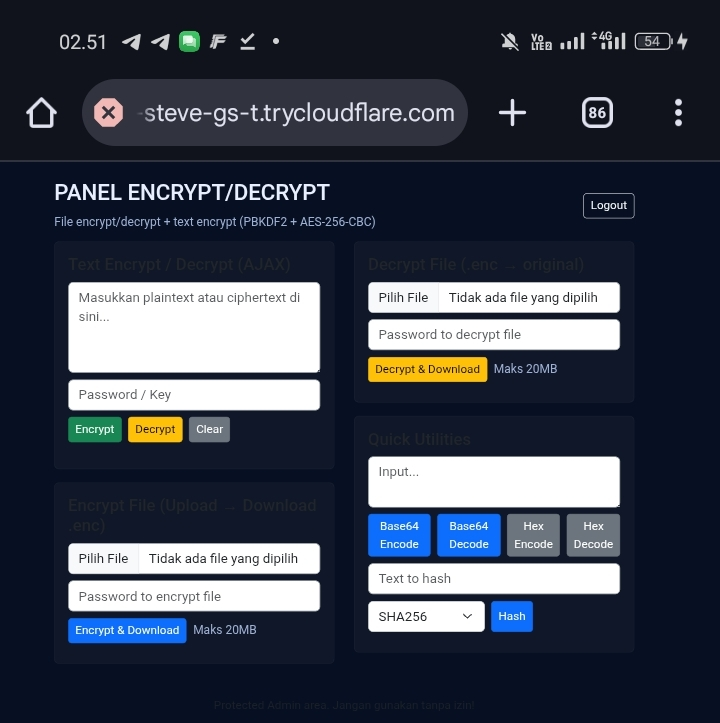

# Web Encryptor/Decryptor (Premium Security Tool) 🔐

Ini adalah aplikasi web berbasis **PHP + OpenSSL AES-256** untuk melakukan **enkripsi & dekripsi file maupun teks**.  
Dilengkapi **proteksi login admin**, **upload file**, dan **AJAX tanpa reload** agar lebih cepat, modern, serta mudah digunakan.  

Cocok untuk kebutuhan pribadi, instansi, maupun sebagai produk digital siap jual kembali. 

---

## Multi 🚀
- **Aman** – AES-256 (standar keamanan global)  
- **Mudah** – cukup login & langsung enkripsi/dekripsi via browser  
- **Multifungsi** – support teks & file  
- **Cepat** – proses instan (AJAX tanpa reload)  
- **Portable** – jalan di localhost & hosting biasa  
- **Siap Jual** – branding mudah untuk produk keamanan digital  

---

## Fitur Utama ✨
- **Proteksi Login Admin** (hanya user terotorisasi)  
- **Upload File** untuk enkripsi / dekripsi  
- **Enkripsi & Dekripsi Teks Instan**  
- **AJAX** → proses cepat tanpa reload halaman  
- **AES-256 Encryption** dengan OpenSSL  
- **UI Web Sederhana, Modern & User-Friendly**  

---

## Struktur Project 📦
- index.php # Halaman login & dashboard utama
- encrypt.php # Endpoint/proses enkripsi
- decrypt.php # Endpoint/proses dekripsi
- config.php # Konfigurasi login & secret key
- assets/ # Folder CSS, JS, ikon, gambar
- style.css # Tampilan UI
- app.js # AJAX handler
- upload/ # Folder penyimpanan file sementara (chmod 755/775)
- README.md # Dokumentasi

---

## Harga Lisensi / Produk 💰
- **Harga Program Website** ( Rp50.000 )  
- Lisensi **full acces** Bisa langsung digunakan, proteksi login admin aktif, support teks & file, tanpa batasan.  
- Cocok untuk **penjualan ulang** atau penggunaan pribadi.

---

